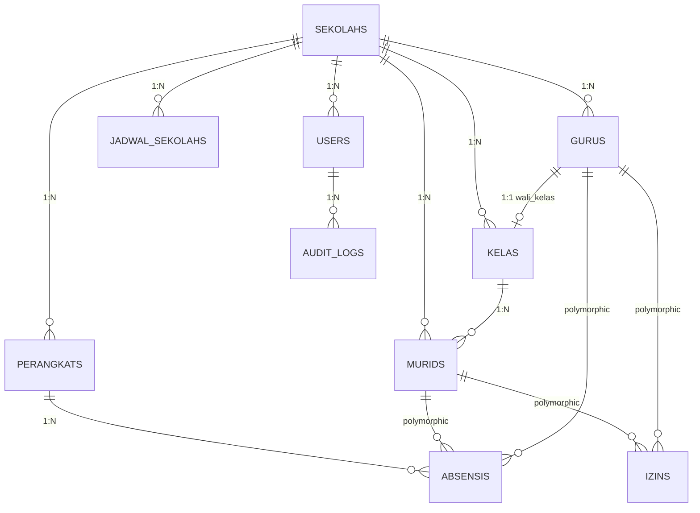

# PRD — SiAbsen
## Sistem Absensi Sekolah Berbasis RFID & Fingerprint

**Versi:** 1.3  
**Tanggal:** 21 Maret 2026  
**Author:** Solution Architect

---

## I. RINGKASAN EKSEKUTIF

### A. Tujuan Produk

Menggantikan sistem absensi manual dengan platform digital otomatis yang:

- Merekam kehadiran murid via RFID Card dan guru via RFID + Fingerprint secara real-time
- Mendeteksi status kehadiran otomatis: Hadir, Terlambat, Tidak Hadir berdasarkan jadwal
- Menyajikan dashboard rekap untuk admin, wali kelas, dan kepala sekolah
- Mendukung multi-perangkat di berbagai lokasi (gerbang, per kelas)
- Memungkinkan kustomisasi identitas sekolah (nama, logo, jadwal, toleransi waktu)

### B. Problem yang Diselesaikan

Sistem absensi manual yang rentan kesalahan, tidak real-time, dan sulit dimonitor.

### C. Target User

| Role | Fungsi |
|------|--------|
| Admin/Operator TU | Kelola data, enroll kartu RFID & fingerprint guru, cetak laporan |
| Wali Kelas | Pantau kehadiran kelasnya, koreksi, input izin |
| Kepala Sekolah | Lihat dashboard tren kehadiran sekolah |
| Murid/Siswa | Tap RFID, lihat rekap absensi sendiri (Phase 2+) |
| Guru | Tap RFID atau fingerprint (Phase 1) |
| Orang Tua | Notifikasi masuk/pulang anak (Phase 2+) |
| Mesin Absen (ESP32) | Push data tap ke API |

---

## II. SCOPE PRODUK & PHASING

### ⭐ Phasing Tap RFID vs Fingerprint (FINAL)

**Rasionalisasi Guru Fingerprint di Phase 1:**
- Jumlah guru 20-50 orang vs murid 200-500 → enrollment guru selesai 2-3 jam
- Guru sudah dewasa → tidak perlu consent form orang tua
- Guru PNS wajib fingerprint untuk bukti kehadiran ke Dinas / klaim tunjangan
- Jari guru lebih bersih & konsisten vs anak-anak yang sering basah/kotor
- Hardware fingerprint (AS608/R307) Rp80rb-150rb sudah include di device Phase 1

### A. In-Scope Phase 1 (MVP)

**Murid (RFID only)**
- ✅ Tap masuk: RFID card → ESP32 → POST /api/absensi
- ✅ Tap pulang: RFID card → log waktu pulang
- ✅ Feedback instan: LCD nama + status + jam, buzzer, LED
- ✅ Status otomatis: Hadir / Terlambat / Alpha berdasarkan jadwal
- ✅ Cooldown anti-double tap (2 detik)
- ✅ Offline buffer SPIFFS (max 500 records)

**Guru (RFID + Fingerprint — salah satu atau keduanya)**
- ✅ Opsi A: Tap RFID saja (kartu) → identifikasi guru
- ✅ Opsi B: Tap Fingerprint saja (jari) → identifikasi guru
- ✅ Opsi C: RFID fallback Fingerprint — jika kartu hilang, bisa pakai jari & sebaliknya (REKOMENDASI)
- ✅ Feedback instan sama: LCD nama + status + jam, buzzer, LED
- ✅ Status otomatis: Hadir / Terlambat / Alpha berdasarkan jadwal (bisa beda dengan jadwal murid)
- ✅ Laporan guru terpisah dari laporan murid

**Flow Absen Guru Phase 1 (Opsi C — Rekomendasi)**

```
Guru tap kartu RFID:
  1. ESP32 baca UID → POST { rfid_uid: "09FF34AB", tipe: "masuk" }
  2. Server: cek Guru::where('rfid_uid', uid)
  3. Response: { nama: "Ibu Siti", status: "Hadir" }
  4. LCD: "Ibu Siti ✅ HADIR - 06:55"

Guru tap fingerprint (kartu hilang/lupa):
  1. ESP32 scan jari → dapat fingerprint_id: 5
  2. POST { fingerprint_id: 5, tipe: "masuk" }
  3. Server: cek Guru::where('fingerprint_id', 5)
  4. Response: { nama: "Ibu Siti", status: "Hadir" }
  5. LCD: "Ibu Siti ✅ HADIR - 06:55 (Fingerprint)"

Jari gagal 3x:
  → LCD: "Fingerprint gagal. Gunakan kartu RFID"
  → Buzzer panjang, LED merah
  → Guru pakai kartu RFID sebagai fallback
```

### B. In-Scope Phase 2

- 🔵 Murid tap Fingerprint (enrollment per murid + consent form ortu)
- 🔵 Murid RFID + Fingerprint ganda (anti-buddy punching)
- 🔵 Guru RFID + Fingerprint wajib keduanya (double verification)
- 🔵 Notifikasi WhatsApp ke orang tua (masuk/pulang murid)
- 🔵 Mobile app portal murid & orang tua (Flutter)
- 🔵 Early warning system (alert ke guru jika murid mulai bolos)
- 🔵 Fingerprint enrollment & verifikasi online via Filament

### C. In-Scope Phase 3

- 🔴 Integrasi BKN / Simdiklat (data kehadiran guru PNS ke sistem pemerintah)
- 🔴 Laporan TPP / tunjangan guru otomatis
- 🔴 Pengajuan izin online (orang tua via app)
- 🔴 Multi-sekolah / multi-tenant (untuk yayasan)
- 🔴 Integrasi SIAKAD (import data murid otomatis)

### D. Out-of-Scope (Semua Phase)

- ❌ Video recording saat absen
- ❌ Face recognition
- ❌ Pembayaran SPP / administrasi keuangan
- ❌ E-learning / akademik

---

## III. USER PERSONAS & USER STORIES

### Persona 1: Rini (Operator TU)

**Profil:**
- Umur: 35 tahun
- Pengalaman: 5 tahun di TU sekolah
- Tech comfort: Menengah
- Tanggung jawab: Input data murid & guru, enrollment kartu RFID & fingerprint guru, cetak laporan

**User Stories:**

**Skenario: Enroll kartu RFID murid**
- GIVEN operator buka halaman Murid → Edit
- WHEN klik "Scan RFID Card", dekatkan kartu ke scanner
- THEN UID otomatis terisi, murid siap absen dengan kartu

**Skenario: Enroll fingerprint guru**
- GIVEN operator buka halaman Guru → Edit
- WHEN klik "Daftarkan Fingerprint", guru tap jari ke sensor
- THEN slot fingerprint (1-162) tersimpan di device & database
- AND guru bisa absen dengan jari atau kartu (fallback)

**Skenario: Cetak laporan rekap harian guru**
- GIVEN operator buka Rekap Absensi → pilih "Guru"
- WHEN pilih tanggal, klik Export PDF
- THEN PDF: Nama Guru, Status, Jam masuk, Metode (RFID/Fingerprint)

### Persona 2: Siti (Wali Kelas 7A)

**Profil:**
- Umur: 42 tahun
- Tech comfort: Rendah-menengah
- Tanggung jawab: Pantau absensi kelas, koreksi error, input izin

**User Stories:**

**Skenario: Monitor kehadiran kelas hari ini**
- GIVEN guru login dashboard Filament
- WHEN navigasi ke "Monitor Absensi"
- THEN tampil tabel: Nama, Status badge, Jam masuk, Metode, Aksi
  - Metode: RFID / Fingerprint / Manual

**Skenario: Koreksi status + audit trail**
- GIVEN murid Alpha karena tidak tap
- WHEN guru Edit Status → pilih Izin → isi alasan
- THEN status terupdate, log: "Diubah oleh Ibu Siti, 08:15, Alpha → Izin"

### Persona 3: Bpk. Kepala Sekolah

**Profil:**
- Umur: 58 tahun
- Tech comfort: Rendah
- Tanggung jawab: Monitoring tren, laporan ke Dinas

**User Stories:**

**Skenario: Lihat tren kehadiran guru + murid**
- GIVEN Kepsek login dashboard
- WHEN klik "Laporan" → filter: Guru / Murid / Semua
- THEN grafik terpisah: tren kehadiran guru vs murid
- AND bisa lihat guru mana yang sering terlambat/alpha

### Persona 4: Ahmad Fauzi (Murid Kelas 7A)

**Profil:**
- Umur: 13 tahun
- Tech comfort: Tinggi
- Pain point: Kartu lupa, tidak tahu tap berhasil, tidak tahu sisa % kehadiran

**User Stories:**

**Skenario: Tap RFID masuk + feedback instan**
- GIVEN Ahmad datang ke gerbang
- WHEN dekatkan kartu RFID ke reader
- THEN LCD: "Ahmad Fauzi ✅ HADIR - 07:14"
  - Buzzer: 1 beep pendek, LED: hijau 3 detik

**Skenario: Lihat rekap absensi sendiri (Phase 2+)**
- GIVEN Ahmad login portal murid
- THEN kalender: hijau/kuning/merah per hari
- AND "87.5% (14/16 hari) — Batas minimum: 75%"

### Persona 5: Pak Budi (Guru Matematika)

**Profil:**
- Umur: 38 tahun
- Status: PNS
- Tech comfort: Menengah
- Pain point: Perlu bukti fingerprint untuk tunjangan, kartu RFID sering tertinggal

**User Stories:**

**Skenario: Tap fingerprint masuk (kartu lupa)**
- GIVEN Pak Budi lupa bawa kartu RFID
- WHEN tap jari di sensor fingerprint
- THEN ESP32 cocokkan template → match slot 12 (Pak Budi)
  - POST { fingerprint_id: 12, tipe: "masuk" }
  - LCD: "Pak Budi ✅ HADIR - 06:58 (Fingerprint)"
  - Buzzer beep, LED hijau

**Skenario: Tap RFID masuk (default sehari-hari)**
- GIVEN Pak Budi bawa kartu RFID
- WHEN tap kartu
- THEN LCD: "Pak Budi ✅ HADIR - 06:58 (RFID)"

**Skenario: Jari tidak terbaca (basah/luka)**
- GIVEN jari Pak Budi basah, fingerprint gagal
- WHEN gagal 3x berturut-turut
- THEN LCD: "Fingerprint gagal. Gunakan kartu RFID"
  - Buzzer panjang, LED merah
- AND Pak Budi pakai kartu RFID sebagai fallback
- AND jika kartu juga tidak ada → lapor TU untuk input manual

### Persona 6: Mesin Absen (ESP32 IoT)

**Profil:**
- Lokasi: Gerbang sekolah + ruang guru
- Modul: RC522 (RFID) + AS608 (Fingerprint) + LCD + Buzzer + LED
- Requirement: Online stabil, offline buffer, feedback instan

**User Stories:**

**Skenario: Tap RFID (murid atau guru)**
- GIVEN device online, murid/guru dekatkan kartu
- WHEN RC522 baca UID: "04AB12CD"
- THEN POST { rfid_uid: "04AB12CD", tipe: "masuk", device_id: "1" }
  - Response: { nama, status, jam, feedback }
  - Render LCD + buzzer + LED

**Skenario: Tap Fingerprint (guru)**
- GIVEN guru tap jari ke sensor AS608
- WHEN sensor cocokkan template → fingerprint_id: 5
- THEN POST { fingerprint_id: 5, tipe: "masuk", device_id: "1" }
  - Response: { nama: "Ibu Siti", status, jam, feedback }
  - Render LCD + buzzer + LED

**Skenario: Fallback fingerprint → RFID**
- GIVEN jari gagal dicocokkan 3x
- THEN device tampil: "Fingerprint gagal. Tap kartu RFID"
  - LED merah berkedip, tunggu input RFID
- AND Guru tap kartu → proses normal

**Skenario: Offline buffer**
- GIVEN internet putus
- WHEN tap RFID / fingerprint
- THEN simpan ke SPIFFS: { uid/fp_id, tipe, timestamp }
  - LCD: "OFFLINE — Buffer: 3 records"
- AND Saat online kembali: auto-sync, clear buffer

---

## IV. BEST PRACTICE SISTEM ABSENSI SEKOLAH

### BP1: Feedback Instan ke Murid & Guru (WAJIB)

Semua pengguna harus tahu langsung saat itu juga apakah tap-nya berhasil.

| Komponen | Hadir | Terlambat | Error |
|----------|-------|-----------|-------|
| **LCD** | "Nama ✅ HADIR - 07:14" | "Nama ⚠️ TERLAMBAT - 07:32" | "Tidak dikenal ❌" |
| **Buzzer** | 1 beep pendek | 2 beep | 1 panjang |
| **LED** | Hijau | Kuning | Merah |
| **Response** | feedback dikirim di JSON response API | | |

### BP2: Anti-Buddy Punching (WAJIB)

Murid titip absen ke teman adalah masalah umum. Guru sudah ter-handle dengan fingerprint.

- Murid Phase 1: Cooldown 2 detik per device (cegah double tap)
- Murid Phase 2: RFID + Fingerprint ganda (anti-titip)
- Guru Phase 1: Fingerprint = tidak bisa dititipkan secara fisik
- Guru Phase 2: RFID + Fingerprint wajib keduanya

### BP3: Offline Resilience (WAJIB)

WiFi sekolah tidak selalu stabil.

- Offline: SPIFFS buffer max 500 records (~3 hari)
- Online kembali: auto-sync dengan exponential backoff
- Failsafe: LCD indikator OFFLINE MODE yang jelas

### BP4: Positive Attendance Default (WAJIB)

Semua murid & guru default "alpha" di awal hari, berubah "hadir" saat tap.

- Pagi 00:01: scheduler INSERT semua aktif = "alpha"
- Saat tap: UPDATE status = "hadir" atau "terlambat"
- Akhir hari: yang masih "alpha" = benar-benar tidak hadir

### BP5: Toleransi Waktu Fleksibel (WAJIB)

Jam masuk murid dan guru bisa berbeda. Harus bisa dikonfigurasi tanpa coding.

- Jadwal murid & jadwal guru TERPISAH di tabel jadwal_sekolahs
- Admin atur di Filament: hari, jam_masuk, toleransi_menit
- Guru bisa masuk lebih awal dari murid (06:30 vs 07:00)

### BP6: Data Privacy (WAJIB)

Data murid di bawah umur + biometrik guru wajib dilindungi.

- Fingerprint: simpan hanya slot ID (1-162), bukan template/gambar
- Template disimpan di sensor lokal, tidak dikirim ke server
- Consent: guru tanda tangan saat enrollment fingerprint
- Murid: consent form ortu wajib sebelum fingerprint (Phase 2)
- Audit trail: setiap perubahan dicatat immutable

### BP7: Fallback Chain (WAJIB untuk Guru)

Guru harus selalu bisa absen meskipun satu metode gagal.

**Priority fallback guru:**
1. Fingerprint (utama, bukti terkuat)
2. RFID kartu (backup)
3. Input manual oleh admin (last resort, wajib ada keterangan)

### BP8: Phased Rollout

Deploy bertahap: pilot 2 kelas dulu, baru expand.

- Week 1: Pilot 1-2 kelas + guru piket
- Week 2: Evaluate & fix
- Week 3: Expand semua kelas + semua guru
- Week 4: Full deployment, dropout sistem lama

---

## V. REQUIREMENTS DETAIL

### A. Functional Requirements (FR)

#### FR1: Master Data Management

**FR1.1 — Konfigurasi Sekolah**
- ✅ Admin ubah nama, logo, NPSN, alamat di Pengaturan
- ✅ Logo tampil di header Filament & laporan PDF
- ✅ Warna tema (hex color) bisa dikustomisasi

**FR1.2 — Manajemen Murid**
- ✅ CRUD murid: NIS, Nama, Kelas, Foto, JK, Tgl Lahir
- ✅ RFID UID (unique) — wajib Phase 1
- ✅ Fingerprint ID (slot 1-162) — opsional Phase 1, penuh Phase 2
- ✅ Kontak ortu: Nama, HP, Alamat
- ✅ Import massal dari Excel
- ✅ Soft delete, search by NIS/Nama, filter by Kelas

**FR1.3 — Manajemen Guru**
- ✅ CRUD guru: NIP, Nama, Foto, Jabatan, Status (PNS/Honor)
- ✅ RFID UID (unique) — Phase 1
- ✅ Fingerprint ID (slot 1-162) — Phase 1
- ✅ Enrollment fingerprint: guru datang ke TU, tap jari, slot tersimpan
- ✅ Fallback: guru bisa punya RFID + Fingerprint keduanya
- ✅ HP, Email, soft delete

**FR1.4 — Manajemen Kelas**
- ✅ CRUD kelas: Nama, Tingkat, Wali Kelas, Kapasitas
- ✅ Satu kelas → banyak murid, satu wali kelas → satu kelas

**FR1.5 — Jadwal Sekolah (Fleksibel, per Subjek)**
- ✅ Jadwal murid: jam masuk/pulang per hari + toleransi
- ✅ Jadwal guru: jam masuk/pulang per hari + toleransi (bisa beda dengan murid)
- ✅ Override periode khusus (ujian, Ramadan)
- ✅ Admin ubah di UI Filament tanpa coding

#### FR2: Absensi Core (Phase 1)

**FR2.1 — REST API Endpoint (Handle RFID + Fingerprint)**

```http
POST /api/v1/absensi
Header: X-Device-Key: [device_key]
Body (salah satu rfid_uid atau fingerprint_id wajib ada):
{
  "rfid_uid": "04AB12CD",      // jika tap RFID
  "fingerprint_id": 5,         // jika tap Fingerprint (guru)
  "tipe": "masuk|pulang",
  "device_id": "1",
  "timestamp": "2026-03-21T07:15:00Z"
}
```

**Response 200 (Hadir):**
```json
{
  "success": true,
  "nama": "Pak Budi",
  "role": "guru",
  "status": "hadir",
  "metode": "fingerprint",
  "waktu": "06:58",
  "feedback": {
    "lcd_text": "Pak Budi ✅ HADIR - 06:58 (Fingerprint)",
    "buzzer": "beep_short",
    "led_color": "green"
  }
}
```

**FR2.2 — Logic Identifikasi Subjek (Backend)**

```php
$user = null;

if ($request->rfid_uid) {
    $user = Murid::where('rfid_uid', $request->rfid_uid)->first()
         ?? Guru::where('rfid_uid', $request->rfid_uid)->first();
}

if (!$user && $request->fingerprint_id) {
    // Fingerprint Phase 1: hanya untuk guru
    $user = Guru::where('fingerprint_id', $request->fingerprint_id)->first();
}

if (!$user) {
    return response()->json([
        'success' => false,
        'pesan' => 'RFID/Fingerprint tidak dikenal',
        'feedback' => [
            'lcd_text' => 'Tidak dikenal ❌',
            'buzzer' => 'beep_long',
            'led_color' => 'red'
        ]
    ], 404);
}
```

**FR2.3 — Positive Attendance Default**
- ✅ Pagi 00:01: scheduler buat record alpha semua murid & guru aktif
- ✅ Tap masuk → UPDATE status hadir/terlambat
- ✅ Tidak tap sampai akhir hari → tetap alpha

**FR2.4 — Feedback Instan (WAJIB)**
- ✅ LCD: Nama + emoji status + jam + metode (RFID/Fingerprint)
- ✅ Buzzer: beep_short/beep_double/beep_long
- ✅ LED: green/yellow/red, 3 detik nyala
- ✅ Semua feedback ada di JSON response API

**FR2.5 — Anti-Double Tap**
- ✅ Cooldown 2 detik per device setelah tap berhasil
- ✅ Tap kedua dalam 2 detik diabaikan

**FR2.6 — Offline Buffer**
- ✅ SPIFFS/SD card buffer max 500 records
- ✅ Auto-sync dengan exponential backoff saat online
- ✅ LCD indikator OFFLINE MODE yang jelas

**FR2.7 — Input Manual**
- ✅ Admin/guru bisa input manual jika mesin error
- ✅ Wajib isi alasan (kartu hilang, mesin error, dll)
- ✅ Audit trail: siapa input, kapan

#### FR3: Dashboard & Monitoring

**FR3.1 — Home Dashboard**
- ✅ Widget: Total hadir murid hari ini (hadir + terlambat)
- ✅ Widget: Total hadir guru hari ini
- ✅ Widget: Alpha murid + alpha guru (terpisah)
- ✅ Widget: Device online/offline
- ✅ Grafik tren 7 hari (murid + guru)
- ✅ Log real-time: tap masuk terbaru (nama, role, metode)

**FR3.2 — Monitor Real-time**
- ✅ Tab Murid: NIS, Nama, Kelas, Status badge, Jam, Metode, Aksi
- ✅ Tab Guru: NIP, Nama, Jabatan, Status badge, Jam, Metode, Aksi
- ✅ Filter per kelas (murid) / jabatan (guru)
- ✅ Live update setiap tap baru

#### FR4: Laporan & Rekap

- ✅ Rekap harian murid per kelas: NIS, Nama, Status, Jam, Metode
- ✅ Rekap harian guru: NIP, Nama, Jabatan, Status, Jam, Metode
- ✅ Rekap bulanan per murid (kalender + % kehadiran)
- ✅ Rekap bulanan per guru (kalender + % kehadiran)
- ✅ Export PDF dengan header logo & nama sekolah
- ✅ Export Excel untuk arsip
- ✅ Laporan tren: murid vs guru per minggu/bulan

#### FR5: Access Control

- ✅ Super Admin: full akses semua menu termasuk enrollment fingerprint
- ✅ Wali Kelas: monitor & edit kelas sendiri saja
- ✅ Kepala Sekolah: read-only dashboard + laporan
- ✅ Auto-logout idle 30 menit
- ✅ Audit trail immutable untuk semua perubahan data

### B. Non-Functional Requirements (NFR)

| NFR | Requirement |
|-----|-------------|
| **NFR1: Performance** | API response < 500ms (p95) untuk RFID, < 700ms untuk fingerprint |
| **NFR2: Availability** | 99.5% uptime, offline buffer untuk redundancy |
| **NFR3: Security** | HTTPS, API key per device, audit trail, data encryption |
| **NFR4: Kustomisasi** | Logo, warna tema, jadwal fleksibel per sekolah |

---

## VI. TIMELINE IMPLEMENTATION (SDLC — 10 Minggu)

Alur SDLC yang benar: PRD → ERD → Coding → Unit Test → QA & UAT → Staging → Production Deploy → Training & Handover

| Week | Activity |
|------|----------|
| 1-2 | Requirements & Design |
| 3-4 | Database & Backend Development |
| 5-6 | Filament Admin Panel |
| 7 | API Development & ESP32 Integration |
| 8 | Testing & Bug Fixing |
| 9 | Deployment & Documentation |
| 10 | Training & Handover |

---

## VII. TECHNICAL ARCHITECTURE

### Tech Stack

| Layer | Technology |
|-------|------------|
| **Backend** | Laravel 12.x + Filament 3.x |
| **Database** | SQLite (dev) / PostgreSQL (production) |
| **API Auth** | Device Key (X-Device-Key header) |
| **Frontend** | Filament (admin), Blade (basic views) |
| **Hardware** | ESP32 + RC522 (RFID) + AS608 (Fingerprint) |

### API Endpoints Lengkap (Phase 1)

```
AUTH:
  POST /api/v1/login               login user → token
  POST /api/v1/logout              logout → revoke token

ABSENSI (Device Key auth):
  POST /api/v1/absensi             tap RFID/fingerprint → simpan log
  POST /api/v1/perangkat/heartbeat device keep-alive
  GET  /api/v1/perangkat/sync      device ambil config terbaru (jadwal, whitelist)

ADMIN (Filament + Sanctum):
  GET  /api/v1/dashboard           statistik hari ini (live)
  GET  /api/v1/monitor             live table absensi hari ini
  POST /api/v1/absensi/manual      input manual (admin/guru)
  PATCH /api/v1/absensi/{id}       edit status + audit trail

PHASE 2+:
  POST /api/v1/notifikasi/wa       trigger WA ke ortu
  GET  /api/v1/murid/absensi       murid lihat absensi diri
  GET  /api/v1/ortu/absensi-anak   ortu lihat absensi anak
```

---

## VIII. USER INTERFACE & MENU FILAMENT

```
📊 Dashboard
   ├── Widget: Murid Hadir Hari Ini (badge hijau)
   ├── Widget: Guru Hadir Hari Ini (badge hijau)
   ├── Widget: Alpha Murid + Alpha Guru (badge merah)
   ├── Widget: Device Online/Offline
   ├── Grafik Tren 7 Hari (murid vs guru)
   └── Log Real-time (nama, role, metode, jam)

👥 Master Data
   ├── Murid (CRUD, foto, RFID UID, import Excel)
   ├── Guru (CRUD, foto, RFID UID, Fingerprint ID, enrollment)
   ├── Kelas (CRUD, wali kelas)
   └── Jadwal Sekolah
       ├── Jadwal Murid (Senin-Sabtu, toleransi)
       └── Jadwal Guru  (Senin-Sabtu, toleransi — terpisah)

📍 Absensi
   ├── Monitor Hari Ini
   │   ├── Tab: Murid (per kelas, filter status)
   │   └── Tab: Guru  (per jabatan, filter status)
   ├── Input Manual (murid atau guru)
   ├── Manajemen Izin (Phase 1+)
   └── Rekap Harian (murid & guru, PDF/Excel)

📊 Laporan
   ├── Rekap Per Kelas (murid)
   ├── Rekap Per Guru
   ├── Rekap Bulanan Murid
   ├── Rekap Bulanan Guru
   └── Tren Kehadiran (murid vs guru)

🖥️ Perangkat
   └── Manajemen Device (CRUD, generate key, status, last ping)

⚙️ Pengaturan
   ├── Identitas Sekolah (nama, logo, NPSN, kepala sekolah)
   ├── Jadwal Murid
   ├── Jadwal Guru
   ├── Tema Warna (hex color)
   ├── Manage Users (CRUD, role)
   ├── Device Keys (generate & revoke)
   └── Audit Log (readonly, immutable)
```

---

## IX. ERD & DATABASE SCHEMA

### 9.1 Diagram ER (Mermaid)



### 9.2 Definisi Tabel

**Tabel: sekolahs**
- id, nama, npsn, alamat, kepala_sekolah, logo, theme_color, is_active, timestamps

**Tabel: murids**
- id, sekolah_id, kelas_id, nis, nama, rfid_uid, fingerprint_id, jenis_kelamin, tanggal_lahir, foto, nama_ortu, hp_ortu, alamat, is_active, timestamps, soft_deletes

**Tabel: gurus**
- id, sekolah_id, nip, nama, rfid_uid, fingerprint_id, status, jabatan, hp, email, foto, is_active, timestamps, soft_deletes

**Tabel: kelas**
- id, sekolah_id, nama, tingkat, guru_id, kapasitas, timestamps

**Tabel: jadwal_sekolahs**
- id, sekolah_id, role_target, hari, jam_masuk, jam_pulang, toleransi_menit, is_active, timestamps

**Tabel: perangkats**
- id, sekolah_id, nama, lokasi, device_key, tipe, status, last_ping, is_active, timestamps

**Tabel: absensis**
- id, sekolah_id, perangkat_id, subject_id, subject_type, tipe, status, metode, waktu_absen, keterangan, is_synced, synced_at, timestamps

**Tabel: izins**
- id, sekolah_id, subject_id, subject_type, jenis, tanggal_mulai, tanggal_selesai, alasan, lampiran, status, approved_by, approved_at, timestamps

**Tabel: audit_logs**
- id, user_id, action, model_type, model_id, old_values, new_values, ip_address, timestamps

### 9.3 Relasi Antar Tabel

- SEKOLAHS 1:N MURIDS, GURUS, KELAS, PERANGKATS, JADWAL_SEKOLAHS
- KELAS 1:N MURIDS
- GURUS 1:1 KELAS (wali_kelas)
- PERANGKATS 1:N ABSENSIS
- MURIDS / GURUS → ABSENSIS (polymorphic via subject_id + subject_type)
- MURIDS / GURUS → IZINS (polymorphic)
- USERS 1:N AUDIT_LOGS
- JADWAL_SEKOLAHS terpisah per role_target (murid / guru)

### 9.4 Urutan Migration (Dependency Order)

1. create_sekolahs_table
2. modify_users_table (tambah sekolah_id, role, guru_id)
3. create_gurus_table
4. create_kelas_table
5. create_murids_table
6. create_jadwal_sekolahs_table
7. create_perangkats_table
8. create_absensis_table
9. create_izins_table
10. create_audit_logs_table

---

## X. ACCEPTANCE CRITERIA — Go-Live Phase 1

### 10.1 Milestone Reframing Phase 1

Phase 1 ditetapkan ulang menjadi dua stream paralel agar core absensi tetap stabil, sementara integrasi vendor berjalan di jalur terpisah:

1. **Stream Core Absensi Stabil**
   - Fokus pada kestabilan domain inti absensi, keamanan akses, keterlacakan perubahan, dan visibilitas operasional.
2. **Stream Adapter Vendor (Terpisah)**
   - Fokus pada konektivitas perangkat/vendor eksternal, normalisasi event ke format internal, dan keandalan sinkronisasi.

**Vendor prioritas pertama untuk stream Adapter:**
- **Solution / ZKTeco ecosystem** (terminal fingerprint/RFID dan protokol terkait) sebagai target integrasi awal.

### 10.2 Deliverable per Stream (Phase 1)

#### A. Stream Core Absensi Stabil

- Endpoint absensi stabil untuk alur masuk/pulang.
- Mekanisme auth yang konsisten untuk seluruh endpoint operasional.
- Audit trail untuk setiap perubahan data penting absensi.
- Dashboard operasional untuk monitoring status harian.

#### B. Stream Adapter Vendor (Solution/ZKTeco)

- Connector ke perangkat/vendor prioritas.
- Mapping event vendor → event absensi internal.
- Retry queue untuk event yang gagal diproses/sinkron.
- Monitoring adapter (status koneksi, antrian, error rate).

### 10.3 Acceptance Criteria per Stream

#### A. Acceptance Criteria — Stream Core Absensi Stabil

- [ ] Endpoint absensi core tersedia dan lolos uji kontrak API untuk skenario masuk/pulang.
- [ ] Auth endpoint tervalidasi: request tanpa kredensial valid ditolak, request valid diproses benar.
- [ ] Audit log tercatat untuk create/update/koreksi absensi, termasuk actor dan timestamp.
- [ ] Dashboard menampilkan metrik operasional utama (hadir, terlambat, alpha, perangkat aktif) dengan data yang konsisten terhadap database.
- [ ] Skenario operasional harian dapat berjalan tanpa ketergantungan langsung ke adapter vendor tertentu.

#### B. Acceptance Criteria — Stream Adapter Vendor (Solution/ZKTeco)

- [ ] Connector Solution/ZKTeco dapat terhubung dan mengambil event kehadiran dari minimal 1 perangkat uji.
- [ ] Mapping event tervalidasi: event vendor dapat dikonversi ke format internal (subject, waktu, metode, status) tanpa kehilangan field wajib.
- [ ] Retry queue berjalan untuk event gagal: event masuk antrean, diproses ulang otomatis, dan memiliki batas retry + penandaan gagal permanen.
- [ ] Monitoring adapter tersedia: status koneksi, jumlah antrean, retry count, dan error terbaru dapat dipantau tim operasional.
- [ ] Kegagalan adapter tidak menghentikan layanan core absensi; core tetap melayani endpoint internal secara normal.

- [ ] Murid tap RFID → tercatat Hadir/Terlambat/Alpha sesuai jadwal
- [ ] Guru tap RFID → tercatat Hadir/Terlambat/Alpha sesuai jadwal guru
- [ ] Guru tap Fingerprint → tercatat dengan metode "fingerprint"
- [ ] Guru jari gagal 3x → LCD tampil "Gunakan kartu RFID", fallback jalan
- [ ] Feedback LCD + buzzer + LED muncul setiap tap (berhasil maupun gagal)
- [ ] Anti-double tap: tap 2x dalam 2 detik hanya tercatat 1x
- [ ] API response time < 500ms (p95) untuk RFID, < 700ms untuk fingerprint
- [ ] Offline buffer 50+ records & sync otomatis saat online
- [ ] Dashboard murid & guru terpisah, live auto-refresh
- [ ] Export PDF rekap harian dengan logo sekolah (murid & guru)
- [ ] Import 100 murid via Excel < 5 menit
- [ ] HTTPS aktif & sertifikat valid
- [ ] Backup harian otomatis berjalan
- [ ] Audit log tercatat setiap edit status absensi
- [ ] Operator TU bisa enroll RFID murid & fingerprint guru tanpa bantuan developer

---

## XI. RISIKO & MITIGATION

| Risiko | Mitigation |
|--------|------------|
| Fingerprint sensor gagal membaca | RFID sebagai fallback, input manual sebagai last resort |
| WiFi sekolah putus | Offline buffer SPIFFS, auto-sync saat online |
| RFID card hilang | Admin bisa re-assign kartu baru via dashboard |
| Data murid bocor | Audit trail, data encryption, access control |
| Device ESP32 rusak | Multi-device setup, device dapat diganti tanpa reset data |

---

## XII. SUCCESS METRICS

| Metric | Target |
|--------|--------|
| Kehadiran tercatat otomatis | > 95% tanpa input manual |
| Response time API | < 500ms (RFID), < 700ms (Fingerprint) |
| Uptime sistem | > 99.5% |
| User satisfaction (admin/guru) | > 4/5 rating |
| Waktu enrollment per murid | < 1 menit |
| Waktu enrollment per guru | < 2 menit |

---

## XIII. GLOSSARY

### 13.1 Domain Istilah

- Label/terminologi domain pada UI **tidak hardcoded** di kode sumber.
- Semua istilah ditentukan melalui **konfigurasi aplikasi** agar bisa disesuaikan per institusi (contoh: Sekolah ↔ Pondok, Murid ↔ Santri, Guru ↔ Ustadz/Ustadzah).
- Perubahan istilah dilakukan oleh admin saat onboarding/konfigurasi awal tanpa perlu deploy ulang aplikasi.

### 13.2 Konfigurasi untuk Pondok

Field minimum yang harus diset saat onboarding Pondok:

| Field Konfigurasi | Contoh Nilai Pondok | Keterangan |
|-------------------|---------------------|------------|
| `institution_type` | `pondok` | Menentukan preset domain lembaga |
| `label_school` | `Pondok` | Pengganti istilah "Sekolah" |
| `label_student` | `Santri` | Pengganti istilah "Murid/Siswa" |
| `label_teacher` | `Ustadz/Ustadzah` | Pengganti istilah "Guru" |
| `label_class` | `Kelas/Halaqah` | Istilah rombel/kelas belajar |
| `label_guardian` | `Musyrif/Wali Santri` | Istilah pendamping/wali |
| `label_attendance_menu` | `Absensi Santri` | Label menu utama absensi |
| `timezone` | `Asia/Jakarta` | Acuan waktu absensi & scheduler |

| Istilah | Definisi |
|---------|----------|
| **Alpha** | Tidak hadir tanpa keterangan |
| **AS608/R307** | Sensor fingerprint module |
| **Buddy punching** | Titip absen ke teman |
| **Cooldown** | Jeda anti-double tap |
| **ESP32** | Microcontroller IoT |
| **Filament** | Laravel admin panel framework |
| **RC522** | RFID reader module |
| **SPIFFS** | Flash filesystem untuk ESP32 |
| **UID** | Unique ID dari kartu RFID |

---

## XIV. APPROVAL & SIGN-OFF

| Role | Name | Signature | Date |
|------|------|-----------|------|
| Product Owner | | | |
| Solution Architect | | | |
| Lead Developer | | | |
| QA Lead | | | |

---

**Dokumen ini adalah referensi lengkap pengembangan SiAbsen v1.3.**

Perubahan utama dari v1.2:
- Guru RFID + Fingerprint masuk Phase 1
- Murid Fingerprint masuk Phase 2
- Jadwal guru terpisah dari murid
- Fallback chain guru (Fingerprint → RFID → Manual)

**Last Updated:** 21 Maret 2026  
**Versi:** 1.3  
**Author:** Solution Architect
